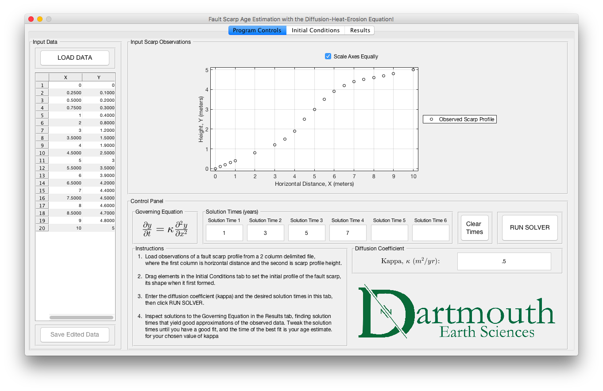
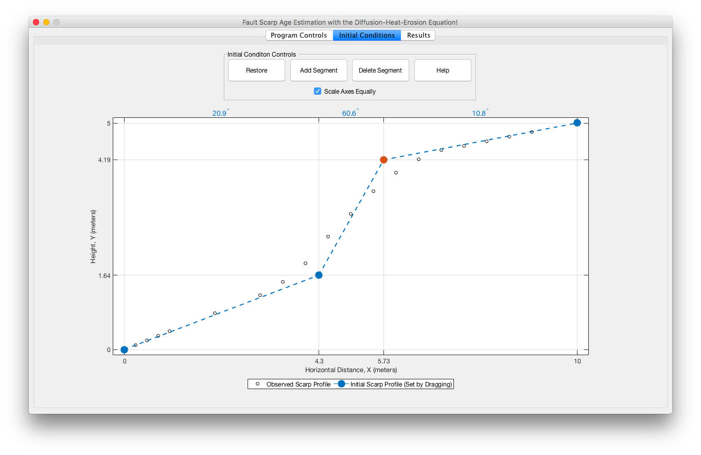
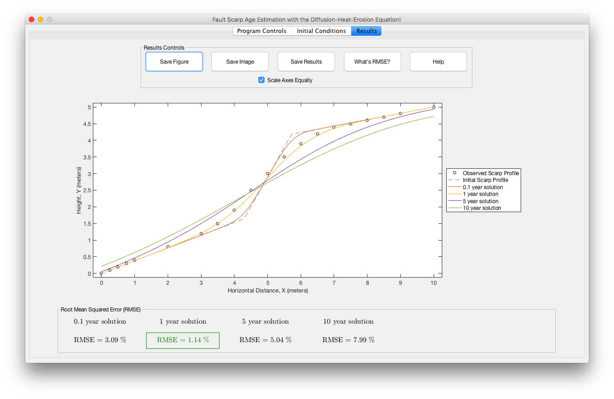

# fault-scarp

This repository contains MATLAB code for estimating the age of a fault scarp. The code generates a GUI, allows a user to input the measured profile of a fault scarp and an estimate for the scarp's initial profile, then uses the diffusion equation (approximating erosion over time) to estimate the erosion time between the initial and measured scarp profiles. The initial condition is an educated guess of the scarp's initial profile (its shape just after the fault slipped) and boundary conditions assume the slopes of the land surfaces far away from the scarp are constant. By comparing the solutions for different elapsed times to the measured profile, the age of the scarp can be guessed. Solutions that closely match the measured profile represent good guesses of the scarp's age.

First, the scarp profile is loaded into the program from a delimited file, where the first column contains horizontal distances along the scarp and the second column contains corresponding height measurements. Next, the user selects a diffusion coefficient and provides some guesses at the age of the scarp. This information lives in the first panel of the GUI, the control panel, which is shown below.

After providing the control panel information, the user sets an initial scarp profile in the next panel by dragging around line elements in a plot. This initial profile, which represents the initial conditions when solving the diffusion-erosion equation, is guessed and not directly measured. The guess is informed by the fact that normal fault planes tend to dip about 60 degrees and by measurements of the slope of the land surface far away from the scarp. The user sets the initial profile so that
* the slope of the line segment representing the scarp is about 60 degrees
* line segments on either side of the scarp have the same slope as the land surfaces far away from the scarp

The second panel (initial conditions panel) is shown below with an initial scarp profile already set.

Finally, back in the control panel, the user clicks "RUN SOLVER" to obtain eroded scarp profiles for the input solution times. The solver uses the initial profile and the input diffusion coefficient to solve the 1D diffusion equation. The results panel now shows the eroded profiles and the root-mean-square error for each solution. To refine the solutions, the user goes back to the control panel and runs the solver for different times until one of the solutions fits the observed profile reasonably well. The results panel is shown below.

There are some other bells and whistles, like the option to edit and save the input data and to save the results in several formats.
